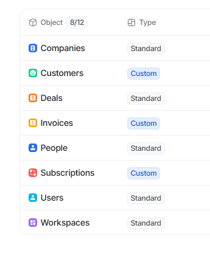

# Stripe 🤝 Attio

> [!NOTE]
> This app is community-maintained and not officially affiliated with Stripe or Attio. All rights regarding the trademark & logo for Stripe belong to Stripe Inc. All rights regarding the trademark & logo for Attio belong to Attio Ltd.

Sync resources from Stripe to Attio custom objects in realtime. Connect your Stripe account in one click and the app will automatically create custom objects in Attio and capture any changes in Stripe in your workspace.

## Features

The app will create syned objects for the following resources:

* Customers: All of your Stripe customers will be synced into a `Customers` object in Attio. Key information such as name and email address will be brought over, and all of their properties will be mapped to attributes.
* Invoices: All of your Stripe invoices will be synced into a `Invoices` object in Attio. Each invoice will be linked to its corresponding customer.
* Subscription: All of your Stripe subscriptions will be synced into a `Subscriptions` object in Attio. Each subscription will be linked to its corresponding customer.

## Requirements

You need at least 3 available custom objects in your workspace. Practically this means you need at least the Plus plan, if you disable Users, Organizations, and Deals.

We recommend Pro or Enterprise since both plans have enough objects to not interfere with the rest of your CRM.

## Installation

1. In Attio, click on the top left on your organization > Workspace settings > Apps
2. Search for "Stripe" and click "Install"
3. In the connection tab, click on "Connect"
4. Paste your Stripe Secret Key in the "Workspace Connection" field, you can find your secret key under https://dashboard.stripe.com/apikeys
5. You are all set! 🥳🥳 Check out the customization guide to make your workspace look good.

## Customization

By default, all custom objects have the default settings, which mean they are grey and have a box as icon. That hurts our eyes, so let's change it.

1. Click on the top left on your organization > Workspace settings > Objects.
2. Click on the Customer Object and under "Singular noun" click on the icon.
3. Set the icon to the "Happy Face" emoji and color to green.
4. Go back and click on the Invoice object.
5. Set the icon to the "Dollar" emoji and color to yellow.
6. Go back and click on the SUbscription object.
7. Set the icon to the "Two Dot Connected" emoji (last emoji on the bottom-right) and color to red.

Already looks soo much better. Now lets customize the record pages.

1. Click on the Customer object again, and go to the Appearance tab.
2. Set the Record text to Name.
3. Click on "Configure record page", and add three widgets: Monthly Revenue, Average Order Value, and Total Revenue.
4. Go back twice, and click on the Invoice object.
5. In the Appearance tab, choose the Receipt Number as Record Text.
6. Go back, then click on the Subscription object.
7. In the Appearance tab, choose the Subscription ID as Record Text.

Nice! We are almost done. Last thing to do is really simple: Go back to your Attio Workspace and on the sidebar click on each record (Customers, Invoices, Subscriptions) once, and add a default list view for all of them.

Puh, hope you stayed until the end here. But now your workspace is ready to go. The app has configured everything else for you automatically.

